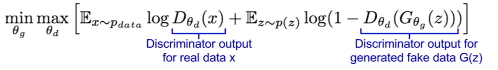

# Brain-MRI-Style-Transfer-With-GAN
A capstone project dedicated to leveraging Style GAN (Generative Adversarial Network) to generate Brain MRI images of different contrasts

## Problem Statement
To build a Generative adversarial model(modified U-Net) which can generate artificial MRI images of different contrast levels from existing MRI scans. 

## Style GAN Architecture

## UNet Architecture

## Basics of a GAN

### Components of GAN
<b>1. Discriminator :</b> A classifier network that identfies whether a generated data (say, image) is fake or not.  
<b>2. Generator :</b> A network that generates fake data (say, image) from random noise samples. It's objective is to generate surreal data and fool the discriminator network.
### Loss & Objective Function
<b>1. Discriminator Loss = </b> The loss associated with classifying the real-image and the generated fake image.   
<b>2. Generator Loss = </b> The loss associated with generating the fake image, to make it look surreal, .i.e. exclusively on the generator output.   
<b>3. Objective Function </b>  

 
-> Here, we have to maximize the likelihood for discriminator being wrong  
-> The discriminator tries to maximize the objective function (Gradient Ascent)  
-> The generator tries to minimize the objective function (Gradient Descent)

## Cycle GAN

